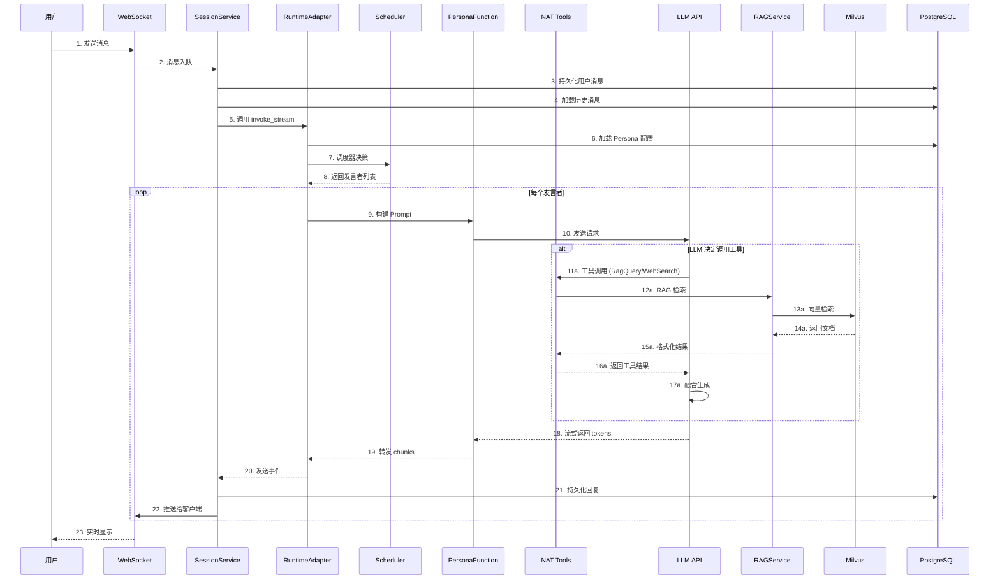

# LLM Response Speed Analysis / LLM 回复速度影响因素分析

> **English Summary**: This document provides a comprehensive analysis of factors affecting LLM response speed in the Mio multi-agent platform. It covers the complete request-response pipeline from user message to final reply, identifies latency bottlenecks, and provides optimization recommendations. Key findings: LLM API calls account for 60-80% of latency, WebSearch tool can add 500-5000ms, and database operations add 20-100ms.

本文档系统性地分析了 Mio 平台中影响 LLM 回复速度的各个过程，从用户发送消息到收到完整回复的全链路延迟拆解。

## 1. 整体响应链路概览



## 2. 各阶段延迟分析

### 2.1 网络传输层延迟

| 阶段 | 描述 | 典型延迟 | 影响因素 |
|------|------|----------|----------|
| WebSocket 连接 | 客户端与服务器建立 WS 连接 | 50-200ms | 网络质量、地理位置 |
| 消息序列化/反序列化 | JSON 编解码 | <1ms | 消息体大小 |
| 流式推送 | Token 逐个推送到客户端 | 每 token <1ms | 网络带宽 |

**代码位置**: `src/mul_in_one_nemo/service/routers/sessions.py`

### 2.2 会话服务层延迟

| 阶段 | 描述 | 典型延迟 | 影响因素 |
|------|------|----------|----------|
| 消息入队 | 将消息放入异步队列 | <1ms | 队列长度 |
| 用户消息持久化 | 保存到 PostgreSQL | 5-20ms | 数据库负载 |
| 历史消息加载 | 查询历史对话 | 10-50ms | 历史长度、索引效率 |
| 用户 Persona 处理 | 解析 user_persona | <1ms | - |

**代码位置**: `src/mul_in_one_nemo/service/session_service.py`

**关键代码片段**:
```python
# session_service.py:198-207
async def enqueue_message(self, message: SessionMessage) -> None:
    record = await self._repository.get(message.session_id)
    await self._repository.add_message(message.session_id, sender=message.sender, content=message.content)
    history_records = await self._repository.list_messages(message.session_id, limit=self._history_limit)
    # ... 历史消息处理
```

### 2.3 运行时适配器层延迟

| 阶段 | 描述 | 典型延迟 | 影响因素 |
|------|------|----------|----------|
| Persona 配置加载 | 从数据库/缓存加载 | 首次: 50-200ms<br>缓存: <1ms | 缓存命中率 |
| API 配置解析 | 解密 API Key、构建 LLM 客户端 | 5-20ms | 加密算法 |
| Runtime 初始化 | 首次初始化 NAT Runtime | 500-2000ms | Persona 数量、工具注册 |
| 调度器初始化 | 创建 TurnScheduler 实例 | <1ms | Persona 数量 |
| Memory 构建 | 构建对话上下文 | 1-5ms | 历史长度 |

**代码位置**: `src/mul_in_one_nemo/service/runtime_adapter.py`

**关键代码片段**:
```python
# runtime_adapter.py:109-128
async def _ensure_runtime(self, tenant_id: str) -> MultiAgentRuntime:
    runtime = self._runtimes.get(tenant_id)
    if runtime is not None:
        return runtime  # 缓存命中
    # ... 首次初始化（较慢）
```

### 2.4 调度器决策延迟

| 阶段 | 描述 | 典型延迟 | 影响因素 |
|------|------|----------|----------|
| @ 提及解析 | 从消息中提取被 @ 的 Persona | <1ms | 消息长度 |
| 评分计算 | 计算各 Persona 发言意愿分数 | <1ms | Persona 数量 |
| 发言者选择 | 根据分数选择发言者 | <1ms | max_agents_per_turn |

**代码位置**: `src/mul_in_one_nemo/scheduler.py`

**注意**: 调度器本身延迟极低，但决策结果（选择多少个发言者）会显著影响后续 LLM 调用次数。

### 2.5 Persona 函数层延迟 ⚠️ **关键瓶颈**

| 阶段 | 描述 | 典型延迟 | 影响因素 |
|------|------|----------|----------|
| Prompt 构建 | 构建系统提示词和历史上下文 | 1-10ms | 历史长度、Prompt 复杂度 |
| 工具定义注入 | 将工具 schema 添加到请求 | <1ms | 工具数量 |
| LLM API 调用 | **主要延迟来源** | 500-5000ms+ | 见下文详细分析 |

**代码位置**: `src/mul_in_one_nemo/persona_function.py`

**关键代码片段**:
```python
# persona_function.py:175-196
async def _respond_single(input_data: PersonaDialogueInput) -> PersonaDialogueOutput:
    messages = await _build_messages(input_data)  # Prompt 构建
    state = ToolCallAgentGraphState(messages=messages)
    result_state = await graph.ainvoke(state)  # ← 主要延迟来源
```

### 2.6 LLM API 调用延迟 ⚠️ **最大延迟来源**

| 阶段 | 描述 | 典型延迟 | 影响因素 |
|------|------|----------|----------|
| 网络往返 (RTT) | 请求到达 LLM 服务器 | 50-500ms | 服务器位置 |
| 预填充 (Prefill) | 处理输入 tokens | 100-2000ms | 输入 token 数量 |
| 生成 (Decode) | 逐 token 生成输出 | 20-100ms/token | 模型大小、温度参数 |
| 首 token 延迟 (TTFT) | 收到第一个输出 token | 200-3000ms | 输入长度、模型负载 |

**影响因素详解**:

1. **输入 Token 数量** (最关键):
   - System Prompt: 通常 500-2000 tokens
   - 历史对话: 每轮约 100-500 tokens
   - 工具定义: 每个工具约 50-100 tokens
   - **优化建议**: 控制 `memory_window`，精简 System Prompt

2. **模型选择**:
   - 小模型 (如 GPT-3.5): 快但质量较低
   - 大模型 (如 GPT-4): 慢但质量高
   - 本地部署 vs 云端 API

3. **API 服务商**:
   - OpenAI: 全球分布，延迟较低
   - 国内服务商 (SiliconFlow, DeepSeek): 国内访问快
   - 自建服务: 完全可控但需要资源

4. **并发与限流**:
   - API Rate Limit: 可能导致排队
   - 服务端负载: 高峰期延迟增加

### 2.7 工具调用延迟 ⚠️ **可能的额外延迟**

当 LLM 决定调用工具时，会引入额外延迟：

#### 2.7.1 RagQuery 工具

| 阶段 | 描述 | 典型延迟 | 影响因素 |
|------|------|----------|----------|
| 上下文获取 | 获取 tenant_id, persona_id | <1ms | - |
| 查询向量化 | 调用 Embedding API | 50-200ms | Embedding 模型 |
| Milvus 检索 | HNSW 索引相似度搜索 | 10-50ms | 索引大小、top_k |
| 结果格式化 | 构建返回对象 | <1ms | 文档数量 |

**代码位置**: `src/mul_in_one_nemo/tools/rag_query_tool.py`

**总延迟**: 100-300ms

#### 2.7.2 WebSearch 工具

| 阶段 | 描述 | 典型延迟 | 影响因素 |
|------|------|----------|----------|
| DuckDuckGo 搜索 | 发送搜索请求 | 200-1000ms | 网络、搜索词 |
| 页面抓取 | 获取每个结果页面内容 | 每页 200-2000ms | 目标网站响应速度 |
| 内容清洗 | 提取正文、去除标签 | <5ms | 页面大小 |

**代码位置**: `src/mul_in_one_nemo/tools/web_search_tool.py`

**总延迟**: 500-5000ms+ (取决于 `fetch_snippets` 和 `top_k`)

**关键代码片段**:
```python
# web_search_tool.py:80-91
async def _single(input_data: WebSearchInput) -> WebSearchOutput:
    pairs = await _web_search(input_data.query, top_k=input_data.top_k)
    for title, url in pairs:
        if input_data.fetch_snippets:
            snippet = await _web_fetch(url)  # ← 可能很慢
```

### 2.8 消息持久化延迟

| 阶段 | 描述 | 典型延迟 | 影响因素 |
|------|------|----------|----------|
| Agent 回复存储 | 将生成内容保存到数据库 | 5-20ms | 内容长度 |
| 流式事件发布 | 推送到订阅者队列 | <1ms | 订阅者数量 |

**代码位置**: `src/mul_in_one_nemo/service/session_service.py:149-158`

## 3. 延迟瓶颈总结

### 3.1 延迟分布饼图

```
+--------------------------------+
|           延迟分布             |
+--------------------------------+
| LLM API 调用      | 60-80%    |
| 工具调用 (可选)    | 10-25%    |
| 数据库操作        | 5-10%     |
| Runtime 初始化    | 3-5%      |
| 网络传输          | 2-3%      |
| 其他计算          | <1%       |
+--------------------------------+
```

### 3.2 最大延迟来源排名

1. **LLM API 调用** (500-5000ms+)
   - 输入 token 数量（Prompt + 历史 + 工具定义）
   - 输出 token 数量
   - 模型大小和服务器负载

2. **WebSearch 工具调用** (500-5000ms)
   - 网络请求 + 页面抓取
   - 取决于是否启用 `fetch_snippets`

3. **Runtime 首次初始化** (500-2000ms)
   - 只在租户首次访问时发生
   - 后续请求有缓存

4. **RagQuery 工具调用** (100-300ms)
   - Embedding API + Milvus 检索

5. **数据库操作** (20-100ms)
   - 消息持久化 + 历史加载

## 4. 多 Agent 场景特殊考虑

当 `max_agents_per_turn > 1` 或调度器选择多个发言者时：

```
总延迟 ≈ Σ(每个 Agent 的延迟) + 上下文传递开销
```

**示例**: 3 个 Agent 依次发言
- Agent 1: 2000ms (LLM) + 200ms (RAG)
- Agent 2: 1800ms (LLM)
- Agent 3: 2200ms (LLM) + 1000ms (WebSearch)
- **总延迟**: ~7200ms

## 5. 优化建议

### 5.1 LLM 调用优化

| 优化项 | 描述 | 预期收益 |
|--------|------|----------|
| 精简 System Prompt | 移除冗余说明 | 减少 10-20% TTFT |
| 控制 memory_window | 限制历史轮数 | 减少 10-30% TTFT |
| 使用更快的模型 | 如 GPT-3.5-turbo | 减少 50%+ 延迟 |
| 流式输出 | 已启用 | 提升感知速度 |
| 并行调用 | 多 Agent 并行生成 | 理论减少 60%+ |

### 5.2 工具调用优化

| 优化项 | 描述 | 预期收益 |
|--------|------|----------|
| RAG 缓存 | 缓存高频查询结果 | 减少 50%+ RAG 延迟 |
| WebSearch 精简 | 减少 `top_k` 或禁用 `fetch_snippets` | 减少 50-80% 延迟 |
| 工具调用并行化 | 同时调用多个工具 | 减少 30-50% |

### 5.3 基础设施优化

| 优化项 | 描述 | 预期收益 |
|--------|------|----------|
| Runtime 预热 | 启动时初始化常用租户 | 消除首次延迟 |
| 数据库连接池 | 优化 SQLAlchemy 配置 | 减少 20-50% DB 延迟 |
| 就近部署 | LLM API 与后端同区域 | 减少 RTT |
| Milvus 索引优化 | 调整 HNSW 参数 | 减少检索延迟 |

### 5.4 架构层面优化

| 优化项 | 描述 | 实现复杂度 |
|--------|------|------------|
| Agent 并行执行 | 多 Agent 同时调用 LLM | 中 |
| 投机执行 | 预测性调用工具 | 高 |
| 分层缓存 | Prompt 模板缓存、Embedding 缓存 | 中 |
| 负载均衡 | 多 LLM 实例轮询 | 中 |

## 6. 性能监控建议

### 6.1 关键指标

```python
# 建议添加的监控指标
metrics = {
    "llm_request_duration_seconds": Histogram,      # LLM 调用耗时
    "llm_tokens_input_total": Counter,              # 输入 token 计数
    "llm_tokens_output_total": Counter,             # 输出 token 计数
    "tool_call_duration_seconds": Histogram,        # 工具调用耗时
    "rag_retrieval_duration_seconds": Histogram,    # RAG 检索耗时
    "db_query_duration_seconds": Histogram,         # 数据库查询耗时
    "message_e2e_latency_seconds": Histogram,       # 端到端延迟
    "ttft_seconds": Histogram,                      # 首 token 时间
}
```

### 6.2 日志增强点

在以下位置添加计时日志：

1. `session_service.py:enqueue_message` - 消息入队时间
2. `runtime_adapter.py:invoke_stream` - Runtime 调用时间
3. `persona_function.py:_respond_single` - LLM 调用时间
4. `rag_query_tool.py:_single` - RAG 检索时间
5. `web_search_tool.py:_single` - WebSearch 时间

## 7. 总结

影响 LLM 回复速度的主要因素按重要性排序：

1. **LLM API 调用延迟** - 占总延迟 60-80%
2. **工具调用延迟** - 特别是 WebSearch
3. **输入 Token 数量** - 影响 Prefill 时间
4. **多 Agent 串行执行** - 线性增加延迟
5. **数据库和网络** - 基础设施因素

通过合理的配置调优和架构优化，可以将端到端延迟从 5-10 秒降低到 2-3 秒，显著提升用户体验。
