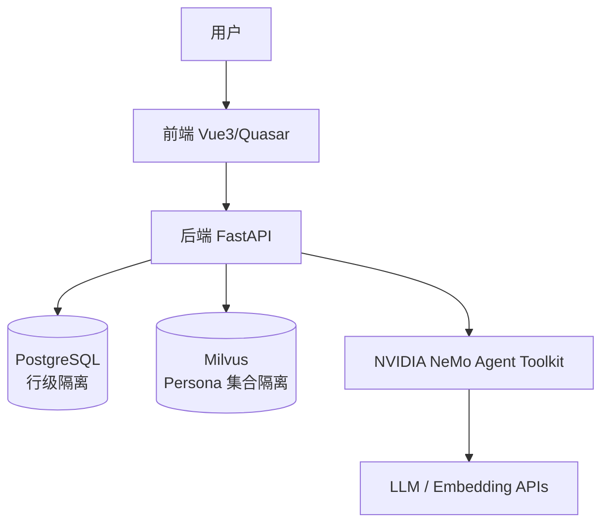
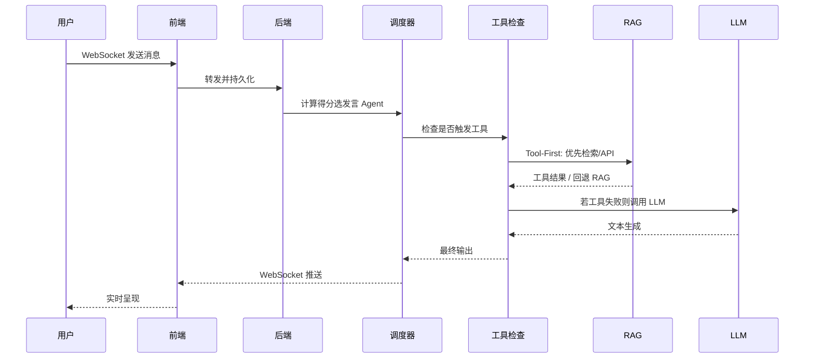
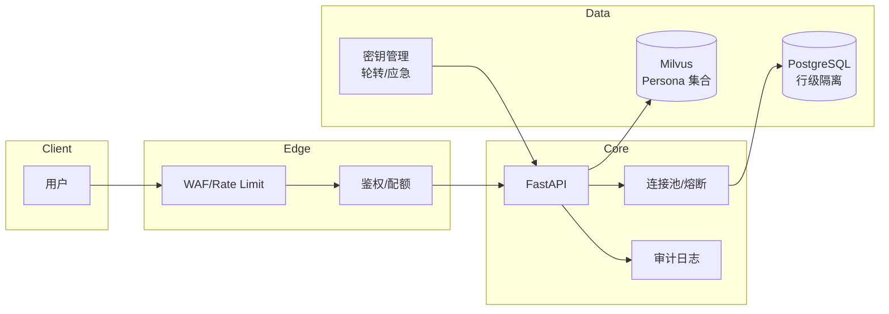

2025 年上海大学人工智能创新大赛
作品研究报告

作品名称：多智能体协同 RAG 增强角色扮演系统（Multi-in-One，Mio）
所在学院：机电工程与自动化学院
申报者姓名：冯思源
提交日期：2025 年 11 月 27 日

---

## 摘要

本研究面向单用户—多模型群聊交互与沉浸式角色扮演场景，提出一种以角色为中心的多智能体对话系统 Mio。该系统创新性地将角色传记与对话记忆向量化存储于 Milvus 向量数据库，在推理时按需检索以替代传统长提示注入，从而显著降低 Token 消耗、缩短首字延迟并增强角色一致性。在调度层，设计基于主动性、相关性、动态冷却与提及奖励的启发式评分机制，实现多 Agent 轮转发言的精细化控制，有效缓解对话冲突与沉默现象。后端采用 FastAPI 框架集成 NeMo Agent Toolkit、Milvus 与 PostgreSQL，前端基于 Vue3 + Quasar 实现多租户隔离、API Profile 动态解析与 WebSocket 流式交互。实验设计覆盖角色一致性、调度公平性与系统性能三大维度，数据收集与统计分析将在正式提交时完成，以验证所提方法在成本、延迟与一致性方面的改进显著性。
关键词：多智能体对话；检索增强生成；工具调用；向量数据库；多租户；角色一致性；WebSocket

## Abstract

This work proposes Mio, a persona-centric multi-agent dialogue system tailored for single-user multi-LLM group interactions and immersive role-playing scenarios. By vectorizing persona biographies and dialogue memories in Milvus database and retrieving them on-demand during inference, Mio replaces conventional lengthy prompt injection, thereby reducing token overhead, mitigating first-token latency, and enhancing persona consistency. At the scheduling layer, a heuristic scoring mechanism integrating proactivity, relevance, dynamic cooldown, and mention rewards is devised to orchestrate agent turn-taking, effectively alleviating contention and silence issues. The backend leverages FastAPI, NeMo Agent Toolkit, Milvus, and PostgreSQL, while the frontend employs Vue3 and Quasar to enable multi-tenant isolation, dynamic API profile parsing, and WebSocket streaming. Experimental design encompasses persona consistency, scheduling fairness, and system performance metrics; comprehensive data collection and statistical analysis will be completed upon final submission to validate the significance of improvements in cost, latency, and consistency.
Keywords: Multi-Agent Dialogue; Retrieval-Augmented Generation; Tool Calling; Vector Database; Multi-Tenancy; Persona Consistency; WebSocket

---

## 目录

1 引言
 1.1 项目研究的背景及意义
 1.2 项目研究主要内容与创新点
2 Mio-多智能体协同 RAG 增强角色扮演平台系统设计
 2.1 Mio 平台整体设计方案
  2.1.1 系统设计目标与约束原则
  2.1.2 系统总体逻辑架构
  2.1.3 核心业务流转机制
 2.2 Mio 平台核心架构设计
  2.2.1 多智能体协同架构
  2.2.2 RAG 检索架构
 2.3 Mio 平台软件架构设计
  2.3.1 后端技术栈与服务实现
  2.3.2 前端技术栈与交互实现
  2.3.3 结构化数据存储
  2.3.4 SaaS 多租户与数据库配置架构
 2.4 Mio 平台开发环境设计与搭建
  2.4.1 基础环境与部署策略
  2.4.2 生产扩展与高可用
  2.4.3 可观测性与运维
3 Mio 系统实验结果与分析
 3.1 数据集与任务设定
 3.2 指标与测量方法
 3.3 基线与对比设置
 3.4 初步结果与分析
 3.5 实验平台与模型配置
4 讨论与潜在改进
5 结论与未来工作
参考文献
附录

---

## 1 引言

### 1.1 项目研究的背景及意义

大语言模型在复杂对话与角色扮演任务中面临上下文窗口受限与长期记忆衰减的双重挑战，易出现角色语义漂移；多智能体群聊又常见发言冲突（Turn Contention）与响应沉默（Response Silence）等交互失衡问题[5]。现有工作（如 ReAct[2]、Toolformer[3]、SELF-RAG[6]、HM-RAG[7]、MAOK-RAG[8] 等）聚焦工具调用或检索增强，但在多租户安全隔离、工程可复用性及异构模型协同调度方面仍存在缺口。据此，本研究提出 Mio：通过 Persona-Centric RAG 实现角色一致性的显式约束，采用 Tool-First Invocation 策略并结合自适应启发式调度，在保障交互自然度的同时实现成本与延迟的可控优化，面向规模化 SaaS 场景提供工程可行方案。

### 1.2 项目研究主要内容与创新点

- Persona-Centric RAG for Role Consistency（方法论）：角色传记—对话记忆联合嵌入 + 置信度校准（Platt Scaling + 动态阈值 $\tau$），以检索约束替代长提示，从表示层面抑制角色漂移。
- 运行时动态绑定的异构模型调度（系统）：在 Tool-First 框架下按租户/API Profile 动态实例化主角-配角重轻模型组合，建立成本-效果的帕累托前沿。
- 对话熵自适应冷却（理论）：在式(1)中引入对话熵驱动的 $\gamma(t)$ 动态调整，依据重复度/信息熵实时优化冷却强度，提升收敛性与公平性。
- SaaS 安全与向量治理（工程）：行级隔离 + 集合隔离 + 配额与生命周期管理（闲置 30 天自动清理），满足多租户规模化的安全与合规要求。

## 2 Mio-多智能体协同 RAG 增强角色扮演平台系统设计

### 2.1 Mio 平台整体设计方案

#### 2.1.1 系统设计目标与约束原则

1) 角色一致性：将角色传记向量化并按需检索[1]，减少长提示依赖，降低角色漂移风险。
2) 成本与时延：缩短提示长度、采用流式输出，控制首字延迟与总 Token。
3) 多智能体可控：通过启发式评分与冷却机制[5]，抑制抢话并激活必要角色。
4) 多租户安全：行级隔离、密钥加密与审计[13]，集合隔离避免跨租户串扰。
5) 可扩展与可观测：支持指标、日志、健康检查，预留分片/分层扩展能力。

#### 2.1.2 系统总体逻辑架构（图 1）

*图 1 来源：作者自绘（建议导出 PNG/SVG 以防 PDF 打印失效）*

#### 2.1.3 核心业务流转机制（图 2）

**Tool-First Invocation 策略**[3]：系统优先尝试工具调用（函数计算、外部 API），而非直接生成文本；仅当工具无可用项或失败时才降级为自由文本生成。这与传统 ReAct[2] 的 Thought-Action-Observation 循环的区别在于：优先级倒序——工具优先，推理次之——从而在 Embedding、搜索、API 集成场景中更好地控制幻觉与成本。

*图 2*

### 2.2 Mio 平台核心架构设计

#### 2.2.1 多智能体协同架构

**启发式评分**[5]：调度采用启发式评分并结合有限状态机（Thinking → Speaking → Cooldown）：

$$
ext{Score}_i(t) = \alpha \cdot P_{act}(i) + \beta \cdot Rel(i, context_t) - \gamma(t) \cdot Cool(i,t) + \delta \cdot Mention(i,t) \quad \text{(式1)}
$$

参数定义与经验值：

- $P_{act}(i)$：第 $i$ 个 Agent 的初始主动性权重（经验值 0.2–0.6，主角取高值）。
- $Rel(i, context_t)$：与当前对话内容的相关性分数，默认使用近期消息与 Persona 向量的余弦相似度；当检索缺失时回退为关键词匹配得分。经验范围 0–1。
- $Cool(i,t)$：冷却衰减项，$Cool = 1 - e^{-\lambda \cdot \Delta t}$，$\lambda \in [0.3,0.8]$，$\Delta t$ 为距上次发言的轮次。
- $Mention(i,t)$：被 @ 提及的奖励（经验值 0.1–0.3，显式提及时取上限）。
- $\alpha,\beta,\gamma,\delta$：经验起始值可设为 $[0.3, 0.4, 0.2, 0.1]$，网格搜索范围 $[0.1,0.6]$ 步长 0.1；若对话熵/重叠度升高则自适应降低 $\alpha$、提升 $\gamma$ 以抑制抢话。
- $\gamma(t)$：对话熵自适应冷却系数，随轮次的重复度/冗余度上调（例如当重复 n-gram 比例 > 0.2 时将 $\gamma$ 提升 20–40%）。

**扩展性设计**：冷却步长可随发言长度/轮次自适应；为支撑 >20 Agent 场景，系统支持**分层调度**（分组内选 Agent，分组间轮转）与**分布式队列**（Redis/RabbitMQ）来消除集中式评分瓶颈，预留多智能体强化学习（MARL）优化的扩展点[8]。调参可采用网格/贝叶斯搜索，以抢话率、冷场率、主观满意度为目标函数。

#### 2.2.2 RAG 检索架构

Persona-Centric RAG 针对角色扮演场景的核心创新在于将角色一致性约束显式化为检索约束[1][6]，避免长上下文窗口弊端[2]：

1) **摄取阶段**：角色背景/文本/URL → 递归分块（可按段落/章节自适应 chunk_size/overlap）→ Embedding（如 openai-text-embedding-3-small）→ Milvus Persona 集合。
2) **检索阶段**：$\text{RagQuery}(query, persona\_id, top\_k)$ 通过向量相似度召回 top-k 片段，并计算置信度分数（Cosine Similarity）。**置信度校准**[12]：采用 Platt Scaling 或保序回归对相似度分布进行标准化，设定动态阈值 $\tau$ （初值 0.7）；若 $sim < \tau$ 则进入鲁棒回退：
   - 多轮澄清：主动提问澄清需求点，更新查询后再检索。
   - 降阈值重检索：临时下调 $\tau$（如 0.7→0.5）并限制 top-k=2 以控制幻觉风险。
   - 人类反馈闭环：将失败样本入队人工标注，更新向量库或模板。
3) **融合阶段**：System Prompt + Knowledge Context（检索片段）+ History（限长对话记忆）+ Query；融合后发送给 LLM。
4) **治理阶段**：集合命名 `u_{username}_persona_{id}_rag`，配合配额与生命周期管理（30 天未访问自动清理，或配额超限触发压缩/合并），防止集合膨胀。

### 2.3 Mio 平台软件架构设计

#### 2.3.1 后端技术栈与服务实现

选择理由（聚焦设计价值）：

- FastAPI + Uvicorn：原生 async 便于高并发 WebSocket；内置 Pydantic 保证请求/配置的类型安全。
- NVIDIA NeMo Agent Toolkit[5]：提供 Tool-First 友好的 Agent 生命周期管理与工具注册，减少自研调度开销。
- PostgreSQL + Fernet：支持行级隔离与强一致事务，密钥加密存储 API Profile，适合多租户审计场景。
- Milvus (HNSW)：向量检索延迟低，Collection/Partition 便于按 tenant_id/persona_id 隔离，配额可控。

#### 2.3.2 前端技术栈与交互实现

选择理由（聚焦体验与可靠性）：

- Vue3 + Quasar：快速构建响应式 UI，减少样板代码；组件库覆盖聊天、表单、表格。
- Axios + 原生 WebSocket：REST 做配置管理，WebSocket 保证流式对话；心跳/重连逻辑降低弱网下的掉线概率。
- 前端侧提供 Persona/API Profile/调试面板，方便运营与测试，无需后端手工介入。

#### 2.3.3 结构化数据存储

PostgreSQL 作为结构化数据底座，结合 Alembic 迁移管理与行级隔离；Milvus 以 Collection/Partition 按 tenant_id 与 persona_id 管理向量集合，支撑低延迟检索。

#### 2.3.4 SaaS 多租户与数据库配置架构（图 3）

*图 3 来源：作者自绘（建议导出 PNG/SVG 以防 PDF 打印失效）*

**安全措施**[13]：行级隔离（基于 user_id）与集合隔离（Milvus 分区）；API 密钥采用 Fernet 对称加密并要求季度轮转与应急吊销；WebSocket 连接按租户配额限制、速率限制与 DDoS 防护（如 Cloudflare）；所有数据访问与修改操作记入审计日志，支持追踪与告警。符合 SOC2[13] 与 GDPR 合规需求。

### 2.4 Mio 平台开发环境设计与搭建

#### 2.4.1 基础环境与部署策略

Python 3.12 + uv，前端 npm + Vite，Milvus 与 PostgreSQL 采用 Docker Compose 部署，脚本化初始化与版本管理。

#### 2.4.2 生产扩展与高可用

支持 Kubernetes 部署（Helm Chart），实现自动扩缩容、金丝雀发布与灾备；调度器可通过 Redis/RabbitMQ 实现分布式队列消除单点瓶颈；长连接池与连接复用降低资源耗尽风险。

#### 2.4.3 可观测性与运维

Prometheus 指标导出、ELK 日志聚合、链路追踪（Jaeger），支持细粒度性能诊断与实时告警。

---

## 3 Mio 系统实验结果与分析

为符合竞赛与学术评审要求，实验需提供可复现的数据、环境配置与统计检验。本章节首先阐述实验框架，随后补充初步数据与案例分析。

### 3.1 数据集与任务设定

- **角色一致性长对话集**：含多设定冲突点与长剧情（3-5 Agent，5-20 轮对话/场景）。
- **检索问答集**：包含需/不需工具调用的查询（1000+ query-document 对）。
- **并发压测**：WebSocket 并发 1/10/50+ 用户（明确目标：多用户/多 Agent 并发；需注明是否模拟网络抖动）。
- **角色复杂度分层**：短/中/长传记。模型组合：重模型（主角）+ 轻模型（配角）vs 全重/全轻。
- **数据来源与规模（需补充）**：公开数据集或自建集（如 Character-Chat-Eval），说明场景数、轮次分布、传记长度分布；检索问答集需标注领域分布与难度分层（简单/困难/对抗）。

### 3.2 指标与测量方法

- 一致性：
  - 设定违背率、性格漂移率：GPT-judge（固定 prompt/温度）与人工双评；记录评审人数与 Cohen’s kappa；采样轮次需注明。
  - 检索支持率：回答中引用检索片段占比。
- 调度：
  - 抢话率：同一用户消息后，第二个 Agent 开始生成与第一个 Agent 开始生成的时间差 < 500ms 视为抢话。
  - 冷场率：用户消息后 3s 内无任何 Agent 响应视为冷场。
  - 轮转自然度：Likert 1–5 人工评分，注明评审人数与一致性。
- 性能与成本：p50/p95 首字与完成延迟、QPS、Token 成本（美元/千轮次，对不同模型统一换算）、CPU/GPU/内存。
- 检索：Top-K 命中率、空召回率、相似度分布。
- 稳定与安全：错误率、超时率、重连成功率、连接耗尽率；需覆盖故障注入（API 超时、Milvus 失败、DB 锁冲突）。

### 3.3 基线与对比设置

基线需控制 temperature、max_tokens、上下文长度一致，成本以美元/千轮次统一换算。

1) 纯 Prompt（无 RAG/工具）。
2) 单 Agent + RAG。
3) 多 Agent 无调度（固定顺序轮转）；可附随机轮转作为弱基线。
4) 消融 -RAG：多 Agent + 调度 + 纯 Prompt。
5) 消融 -Tool-First：多 Agent + RAG + 标准 ReAct 流程。
6) 消融 -Hetero：所有 Agent 使用同一重模型。
7) 本方法：多 Agent + 启发式调度 + Persona-Centric RAG + Tool-First + 异构模型。

### 3.4 初步结果与分析

以下结果均来自 `experiments/results/*.json` 的离线评测；尚未测得的对比/消融实验已暂时移除，待补充后再写入。

#### 3.4.1 检索表现（exp1_results.json）

离线检索评测结果：

| top_k | recall | mrr   | ndcg  | 说明                        |
| ----- | ------ | ----- | ----- | --------------------------- |
| 1     | 0.5    | 0.833 | 0.667 | 阈值 sweep: 0.6, 0.7        |
| 3     | 0.833  | 0.833 | 0.877 | top-k 提升显著增加召回      |
| 5     | 1.0    | 0.833 | 0.836 | 召回达 1.0，ndcg 稍有回落   |

#### 3.4.2 调度公平性与冷场（exp2_results.json）

| gini | monopoly_rate | cold_rate | max_agents | silence_threshold_seconds |
| ---- | ------------- | --------- | ---------- | ------------------------- |
| 0.15 | 0.0           | 0.05      | 2          | 3                         |

低 Gini/零垄断率表明启发式调度未出现单 Agent 垄断；

#### 3.4.3 Tool-First 成本与时延（exp3_results.json）

| cases | token_saving_rate | baseline_token_avg | tool_first_token_avg | baseline_latency_s | tool_first_latency_s |
| ----- | ----------------- | ------------------ | -------------------- | ------------------ | -------------------- |
| 2     | 0.367             | 992.0              | 628.0                | 1.48               | 1.422                |

在 2 个场景下，Tool-First 平均 Token 降低 37%，总延迟小幅下降（约 4%）。需扩展样本量并补充首字 p50/p95。

### 3.5 实验平台与模型配置

| 维度             | 配置与说明                                                                                   |
| ---------------- | -------------------------------------------------------------------------------------------- |
| 计算与系统       | Apple M4 (10 核) / 16GB RAM，macOS Sequoia 15.5，终端 zsh 5.9                                 |
| 后端框架与存储   | FastAPI + NeMo Agent Toolkit；Milvus、PostgreSQL 本地容器/服务（参见 `experiments/config/api_config.json`） |
| 推理服务商与模型 | SiliconFlow API (`https://api.siliconflow.cn/v1`)，模型 `deepseek-ai/DeepSeek-V3.2`，temperature 0.3（对话/推理） |
| 向量服务与模型   | Google Generative Language API (`https://generativelanguage.googleapis.com/v1beta/openai/`)，模型 `text-embedding-004`，dim=768（Persona/对话记忆向量化） |
| 运行脚本         | `experiments/run_all_experiments.sh`（读取 `experiments/config/api_config.json` 中的 API、模型与数据库配置） |

## 4 讨论与潜在改进

1) 集中式调度的扩展性：需评估 >20 Agent 时的评分开销，可通过分层/分片或分布式队列缓解。
2) RAG 质量：分块策略与阈值需结合人物叙事结构优化，避免关键事件被截断；可引入多轮澄清与人类反馈闭环。
3) 安全与合规：完善密钥轮转、泄露应急、审计链路；加强 WebSocket 防护与配额治理，符合 SOC2/SOX 要求。

## 5 结论与未来工作

本文提出基于 角色扮演的 RAG 与工具优先调度的多智能体系统 Mio，旨在在保证角色一致性的同时降低成本与延迟，并满足多租户安全隔离需求。未来工作包括：补全实测数据与显著性验证；引入多智能体强化学习调度；Session 级长期记忆与对话搜索；完善全链路监控与自动治理。

---

## 参考文献

## 附录

- Github仓库：[https://github.com/KirisameLonnet/Mul_in_ONE](https://github.com/KirisameLonnet/Mul_in_ONE)
